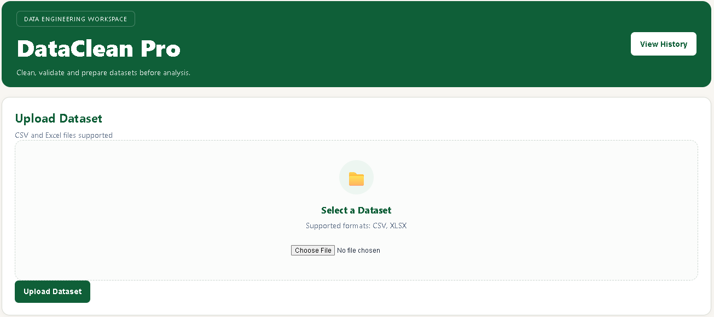
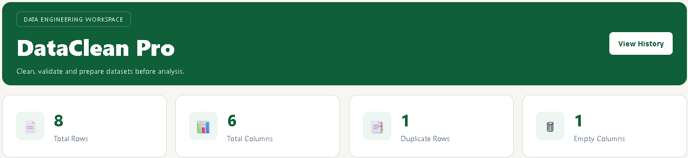
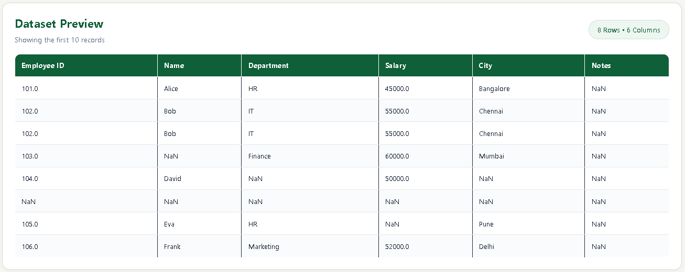
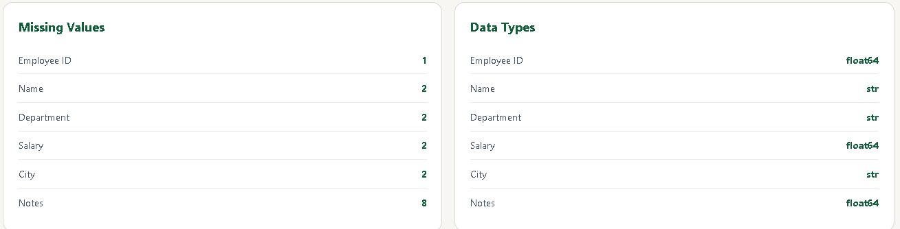
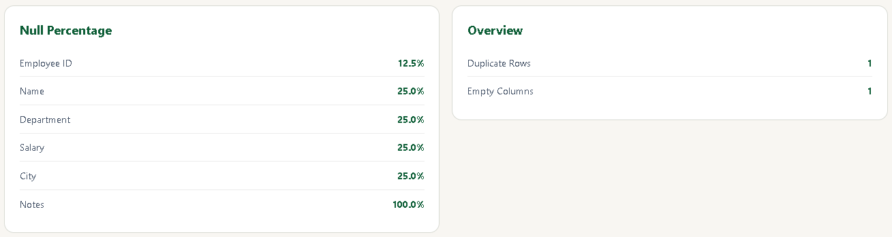
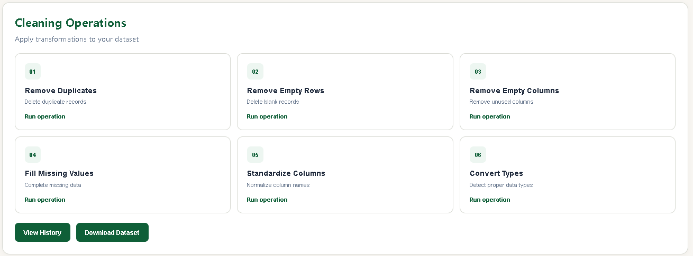
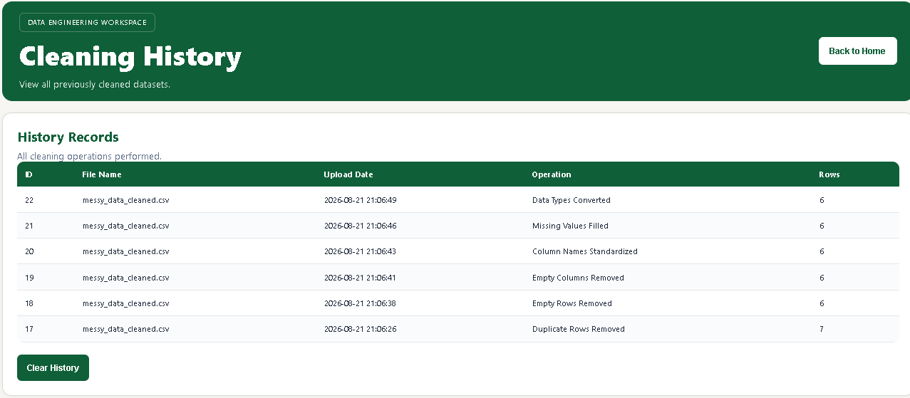

# DataClean Pro

A web-based data cleaning and quality analysis tool built with Flask and Pandas.

DataClean Pro allows users to upload CSV or Excel datasets, inspect data quality, apply common cleaning operations, and download the cleaned dataset.

## Features

- Upload CSV and XLSX datasets
- Preview uploaded datasets
- View dataset row and column counts
- Detect missing values
- Detect duplicate rows
- Detect empty columns
- View column data types
- View null percentages
- Remove duplicate rows
- Remove empty rows
- Remove empty columns
- Fill missing values
- Standardize column names
- Convert data types
- View before/after cleaning summaries
- Save cleaning operation history
- Clear cleaning history
- Download cleaned datasets

## Screenshots

### Dashboard



### Quality Dashboard



### Dataset Preview



### Missing Values and Data Types



### Null Percentage and Overview



### Cleaning Operations



### Cleaning History



## Tech Stack

- Python
- Flask
- Pandas
- SQLite
- HTML
- CSS
- JavaScript

## Project Structure

```text
DataClean-Pro/
│
├── app.py
├── cleaner.py
├── validator.py
├── database.py
├── requirements.txt
├── README.md
├── .gitignore
│
├── templates/
│   ├── index.html
│   └── history.html
│
├── static/
│   └── style.css
│
├── uploads/
├── cleaned/
└── database/
```

## Installation

Clone the repository:

```bash
git clone <your-repository-url>
cd DataClean-Pro
```

Create a virtual environment:

```bash
python -m venv venv
```

Activate it on Windows:

```bash
venv\Scripts\activate
```

Install the dependencies:

```bash
pip install -r requirements.txt
```

## Run the Application

```bash
python app.py
```

Open the application in your browser:

```text
http://127.0.0.1:5000
```

## Workflow

```text
Upload Dataset
      ↓
Dataset Preview
      ↓
Data Quality Analysis
      ↓
Apply Cleaning Operation
      ↓
Before vs After Summary
      ↓
Save Cleaning History
      ↓
Download Cleaned Dataset
```

## Data Cleaning Operations

### Remove Duplicate Rows

Removes duplicate records from the dataset.

### Remove Empty Rows

Removes rows containing no usable data.

### Remove Empty Columns

Removes columns that contain no data.

### Fill Missing Values

Fills missing numeric values using the column mean and missing text values using `Unknown`.

### Standardize Column Names

Normalizes column names for consistent dataset processing.

### Convert Data Types

Converts dataset columns into appropriate data types.

## Data Quality Analysis

DataClean Pro generates a quality report containing:

- Missing value counts
- Duplicate row count
- Empty columns
- Column data types
- Null percentages

## Cleaning History

Each cleaning operation is recorded in SQLite with:

- File name
- Operation performed
- Date and time
- Final row count

Users can review or clear the stored cleaning history from the History page.

## Purpose

This project was built to practice practical Data Engineering and backend development concepts including:

- Data ingestion
- Data validation
- Data cleaning
- Data quality analysis
- Data transformation
- File processing
- Database persistence
- Flask backend development